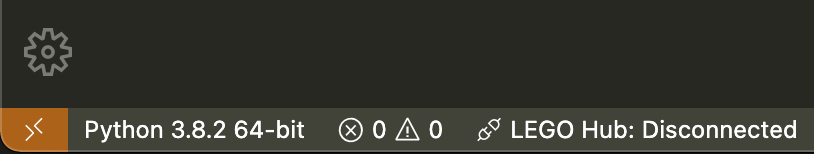
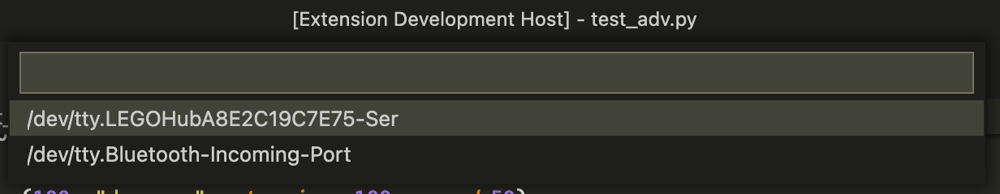
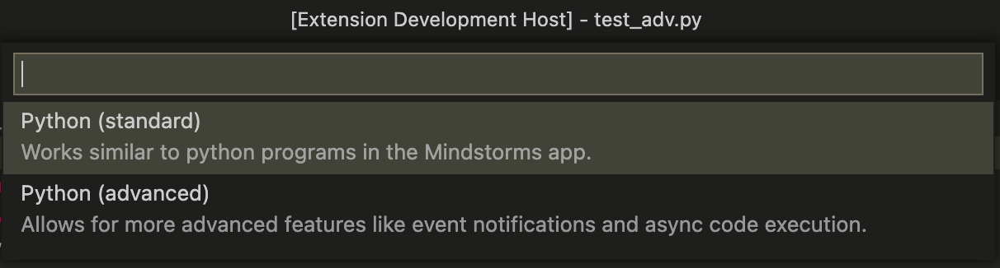

# LEGO SPIKE Prime / MINDSTORMS Robot Inventor Extension

This extension helps you connect to the SPIKE Prime or MINDSTORMS Robot Inventor brick and perform various operations on it. 

## Features

Shows the connections status right in the status bar


\
Clicking on the status will either connect or disconnect (if already connected). Support connecting to USB and Bluetooth (see Known Issues for limitations). 


\
Once connected you can start a running program by choosing its slot. For each slot if a program is present you will see its name next to the slot number:


You can upload two types of programs with this extension:


### Python (standard)

This is more or less the same as a python project, created with the Mindstorms or SPIKE prime apps. But allows you to use your favorite code editor and its extensions instead of the built in one.

### Python (advanced)

This gives you access to an async code execution and event notifications that are provided by built in event loop that runs on the brick. The event loop is used to run Scratch programs and I haven't found any other way to access it from standard python type programs. 

The advanced programs mus follow a specific template in order for them to execute correctly:
```python
async def on_start(vm, stack):
    print("This is the spot of your code")

def setup(rpc, system, stop):
    vm = VirtualMachine(rpc, system, stop, "something_unique")
    vm.register_on_start("another_unique_string", on_start)
    return vm
```
You can check what advanced functions found so far [here](ADVANCED-FEATURES.md). 

## Automatic upload/start of a python file

During active development you will be uploading a program over and over again so going through all the prompts for type and slot is not very convenient. You can skip those prompts and automatically start the program after uploading by adding a specific comment line as first in your program. 
```python
# LEGO type:<advanced / standard> slot:<0-19> [autostart]
```

For example, if I want the program to be uploaded as an advanced python program to slot 5 and autostart it once the upload is finished the comment should be the following
```python
# LEGO type:advanced slot:5 autostart
```

## Known Issues

* When using Bluetooth and you have many programs stored on the brick it stops responding to querying slot info. You should eiher use USB connection or avoid using commands that wuery slot info - for example you can completely avoid them by using the automatic upload comment in your python files. 

## Credits

Thanks to [sanjayseshan/spikeprime-tools](https://github.com/sanjayseshan/spikeprime-tools) and [bricklife](https://gist.github.com/bricklife/13c7fe07c3145dd94f4f23d20ccf5a79) for figuring out currently available JSON RPC that the brick supports. 

## Disclaimer

*This extension uses unofficial and undocumented APIs. They can change without notice. Functions tested on a Mac connecting to a MINDSTORMS Robot Inventor Hub FW Version 1.0.6.34 with runtime version 2.1.4.13*

*LEGO and MINDSTORMS are registered trademarks of the LEGO Group. SPIKE is trademark of LEGO Group.*

