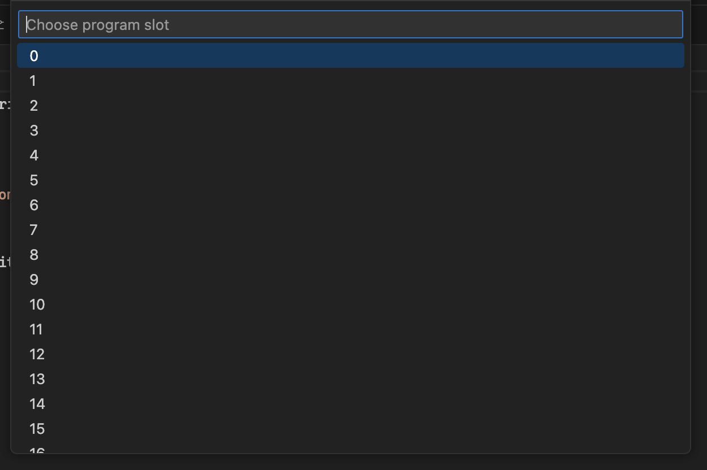

# LEGO SPIKE Prime / MINDSTORMS Robot Inventor Extension

This extension helps you connect to the SPIKE Prime or MINDSTORMS Robot Inventor brick and perform various operations on it.

> [!IMPORTANT]  
> Starting from version 2.x of the extension it will work ONLY with HubOS3. If you are running on the legacy HubOS2, please use the 1.x version and disable auto-updates for the extension.

> [!IMPORTANT]  
> Currently the plugin supports only Bluetooth connection. USB connection coming in the future.

## Features

Shows the connections status right in the status bar


\
Clicking on the status will either connect or disconnect (if already connected).

\
Once connected you can start a running program by choosing its slot.


Also once you are connected in any python file you can execute commands conveniently by using the appropriate button at the top right of the editor file:


### Preprocessor

To support multi files before the compilation (or upload if not compiled) imported files will be inserted in the current python script.
At the moment only

```python
from file_name import *
```

is supported. Files not found are skipped (in the hope they exist on the hub). Nevertheless an error will inform you.

### Compilation

The extension supports compiling Python files to binary (MPY) before uploading. This is controlled by a setting:


## Automatic upload/start of a python file

During active development you will be uploading a program over and over again so going through all the prompts for type and slot is not very convenient. You can skip those prompts and automatically start the program after uploading by adding a specific comment line as first in your program.

```python
# LEGO  slot:<0-19> [autostart]
```

For example, if I want the program to be uploaded to slot 5 and autostart it once the upload is finished the comment should be the following

```python
# LEGO slot:5 autostart
```

## Credits

Thanks to LEGO Group to publish [extensive docs](https://lego.github.io/spike-prime-docs/index.html) on how to work with the HubOS protocol.

## Disclaimer

_LEGO and MINDSTORMS are registered trademarks of the LEGO Group. SPIKE is trademark of LEGO Group._
